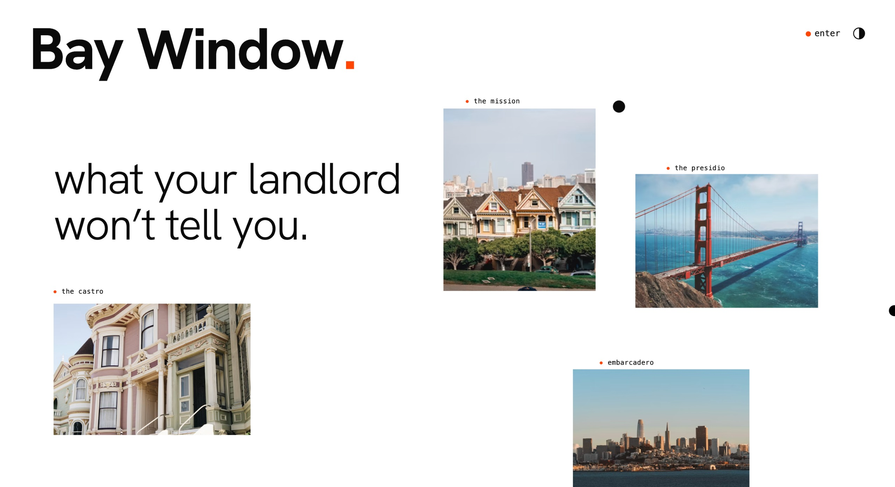
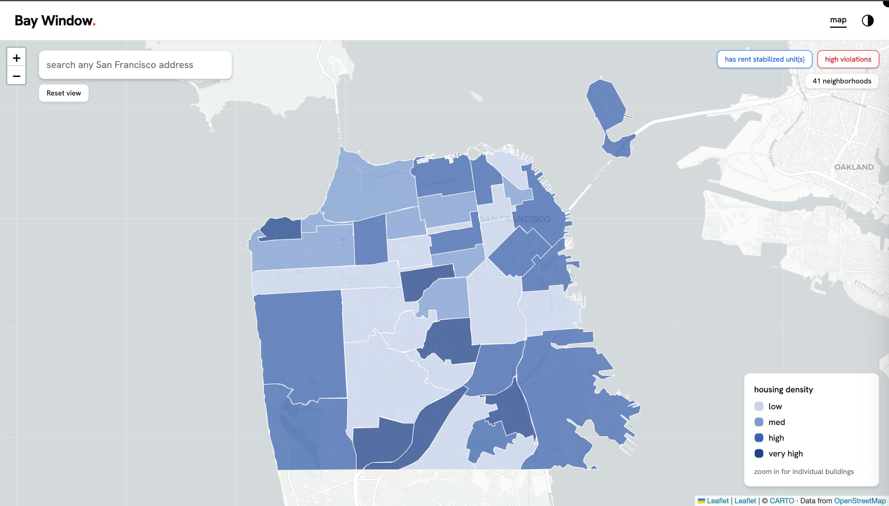
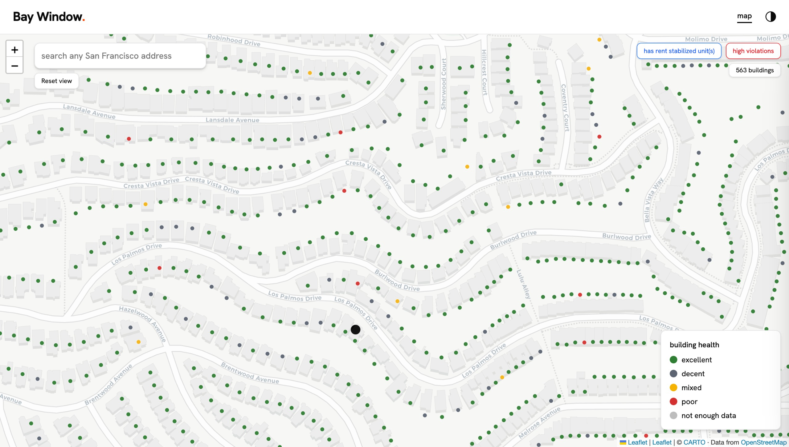
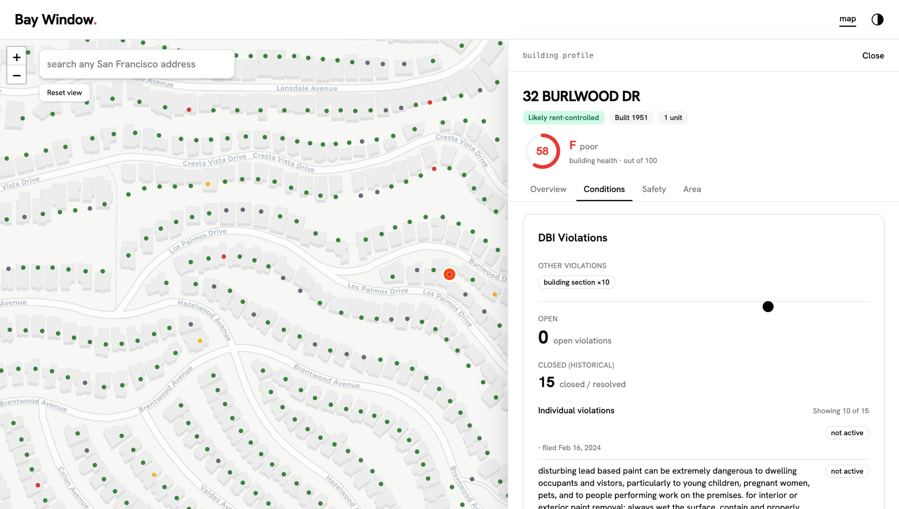

# Bay Window

A free San Francisco building & renter lookup tool. Search any SF address and see a
health/safety profile — DBI violations, complaints, 311 cases, evictions, likely rent
control, crime, permits, seismic retrofit status, transit, and fire incidents — plus a
0–100 building health score and a full-bleed neighborhood map.

All data comes from public [DataSF](https://data.sfgov.org) (Socrata) datasets. No paywall.

## Screenshots

### Landing

The editorial landing page — search any SF address to begin.



### Neighborhood map

A full-bleed choropleth of all 41 SF neighborhoods, shaded by housing density. Toggle
rent-stabilized and high-violation overlays, then zoom in for individual buildings.



### 3D buildings
Toggle "3D buildings" to pitch the same map into a flyover — every building extruded to
its real height (GlobalBuildingAtlas LoD1), tinted by health bucket where data exists.

### Building dots

Zoomed in, every building is a dot colored by its health bucket — excellent, decent,
mixed, poor, or not-enough-data.



### Building profile

Click any building for its full profile: a 0–100 health score, rent-control flag, and
tabbed breakdowns of DBI violations, safety, and neighborhood data.



## Stack

- **Frontend** — React 19 + TypeScript + Vite, Tailwind v4, shadcn (Base UI), MapLibre GL maps
- **3D buildings** — 171k SF footprints with heights from [GlobalBuildingAtlas](https://github.com/zhu-xlab/GlobalBuildingAtlas) (LoD1, CC BY-NC 4.0), tiled with tippecanoe into a self-hosted PMTiles archive (`frontend/public/sf-buildings.pmtiles`, ~24 MB)
- **Backend** — Python FastAPI proxy over the DataSF Socrata API, with an in-memory TTL cache
- **Geocoding** — hybrid, $0 (SF EAS address points; no paid APIs)

## Local development

### Backend

```bash
cd backend
python -m venv venv
source venv/bin/activate          # Windows: venv\Scripts\activate
pip install -r requirements.txt
cp .env.example .env              # then fill in values (all optional for local dev)
uvicorn app.main:app --reload     # serves on http://localhost:8000
```

The backend reads configuration from `.env` (see `.env.example`):

| Variable | Required | Default | Notes |
|---|---|---|---|
| `SOCRATA_APP_TOKEN` | No | _(empty)_ | Free token raises DataSF rate limits — [get one here](https://data.sfgov.org/profile/edit/developer_settings) |
| `CACHE_TTL_SECONDS` | No | `3600` | In-memory cache lifetime |
| `CORS_ORIGINS` | No | `http://localhost:5173,http://localhost:3000` | Comma-separated allowed origins |

### Frontend

```bash
cd frontend
npm install
npm run dev                       # serves on http://localhost:5173
```

The Vite dev server proxies `/api` → `http://localhost:8000`, so run the backend first.

## Production build

```bash
# Frontend — static assets in frontend/dist/
cd frontend && npm run build

# Backend — run under a production ASGI server
cd backend && uvicorn app.main:app --host 0.0.0.0 --port 8000
```

For deployment, set `CORS_ORIGINS` to your real frontend origin (the default is dev-only)
and serve `frontend/dist/` from any static host, pointing its `/api` proxy at the backend.

## Data sources

DBI Complaints & Violations, 311 cases, Rent Board Housing Inventory, Eviction Notices,
Assessor Secured Property Roll, SFPD Incident Reports, Building Permits, Soft-Story
retrofit program, Muni Stops, and Fire Incidents — all via DataSF.
